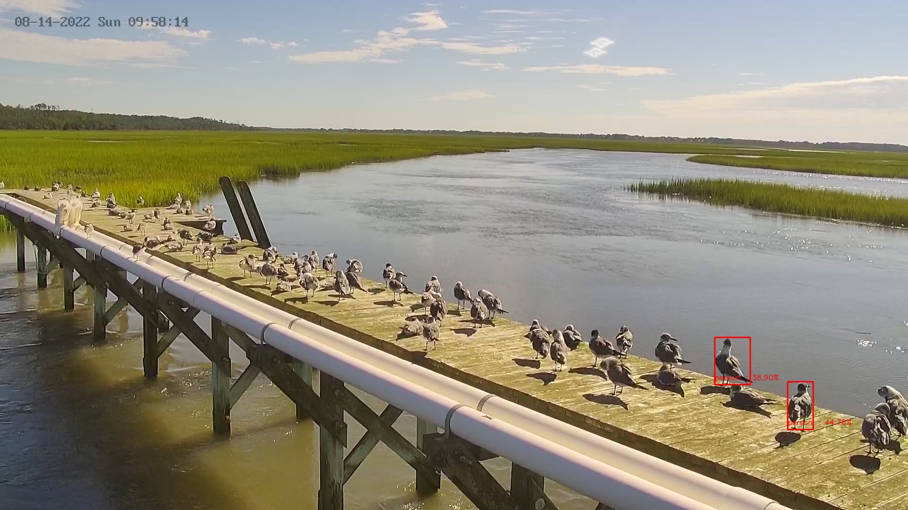

# WebCOOS Object Detection

Pre-trained ML models to detect general objects in images, embedded in a
FastAPI REST interface.



## Local setup

It is recommended to create a new Python virtual environment using `conda`, or
its faster alternative, `micromamba`.

`conda` environment creation and activation:

```shell
conda env create -f environment.yml
conda activate webcoos_object_detection
```

`micromamba` environment creation and activation:

```shell
micromamba create -f environment.yml
micromamba activate webcoos_object_detection
```

## FastAPI Serving

The models can be served using a FastAPI server. The server allows the POSTing of image URLs and raw image (file uploads). The model to use is supplied as URL path parameters.

```shell
POST /{model_name}/{model_version}/upload - Image file upload endpoint
```

The server can be started with

```shell
uvicorn api:app
```

The server can be tested with the `test_api.py` file. It will save images to the `output` folder based on the `model` and `version` requested.

```shell
python ./test/test_api.py
```

The FastAPI server can also be served using Docker:

```shell
docker build -t webcoos_object_detection:latest .
docker run --gpus all --rm --name obj_detector -v $(pwd)/outputs/docker:/outputs -p 8000:8000 webcoos_object_detection
```

And then tested the same as running it outside of Docker

```shell
python ./test/test_api.py
```

## Stream Processing

Run YOLOv8 test:

```shell
python ./test/yolov8_loop.py
```

## Authentication for Customized Metrics

There is an optional feature of the API to allow for tracking its detection
metrics against specific `groups` and `assets`.

*   An `asset` is any device that provides the imagery that is used as input to
    the API. For example: a camera pointing at a beach on Oak Island may be
    referred to with its asset name `oakisland_east`.
*   A `group` is an owning organization or operating organization responsible
    for said asset. This could be an academic institution, a business, etc. For
    the Oak Island, the device could be owned by the University of North
    Carolina, Wilmington (UNCW), and its group name could be `uncw`.

By default, the API will track all metrics against the group `any`, and the
asset `any`. Example metrics stanza:

```
object_classification_detection_counter_total{asset="any",classification_name="sports ball",group="any",model_framework="sahi",model_name="yolo",model_version="v8n"} 0.0
object_classification_detection_counter_total{asset="any",classification_name="kite",group="any",model_framework="sahi",model_name="yolo",model_version="v8n"} 0.0
object_classification_detection_counter_total{asset="any",classification_name="surfboard",group="any",model_framework="sahi",model_name="yolo",model_version="v8n"} 0.0
```


To specify a `group` and `asset` to be calculated apart from the catch-all
`any`, you must included the following headers in your endpoint requests:

```
Authorization: Bearer [token]
x-axds-group: [group]
x-axds-asset: [asset]
```

The authorization `[token]` must be provided by API administrators. Without an
authorization token, the object detection request will fail.

If you have an authorization token, you will be able to submit requests for
object detections, and any successful detections against your requested `group`
and `asset` will be counted in their own metric labels (in addition to be
counted against the `any`/`any` catch-all labels).

Example:

```
object_classification_detection_counter_total{asset="oakisland_west",classification_name="umbrella",group="uncw",model_framework="sahi",model_name="yolo",model_version="v8n"} 1.0
object_classification_detection_counter_total{asset="oakisland_west",classification_name="person",group="uncw",model_framework="sahi",model_name="yolo",model_version="v8n"} 1.0
object_classification_detection_counter_total{asset="oakisland_east",classification_name="person",group="uncw",model_framework="sahi",model_name="yolo",model_version="v8n"} 1.0
```
